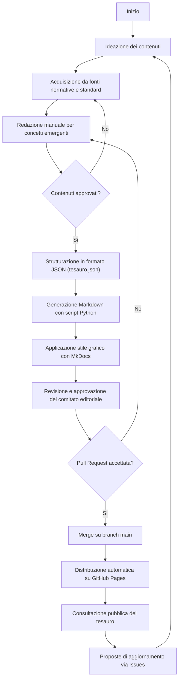

{width=100px height=100px}

# Tesauro bilingue sulla governance dell’intelligenza artificiale

[Link alla repository del progetto](https://github.com/mauritiuss/tesauro-ai)

## Introduzione

Il presente progetto, sviluppato nell’ambito del corso di *Editoria digitale*, ha come obiettivo la progettazione e realizzazione di un workflow editoriale per la gestione di un **tesauro bilingue (inglese-italiano) dedicato alla governance dell’intelligenza artificiale**.  

Il lavoro si concentra su tre aspetti fondamentali: 

- La scelta di un **formato sorgente strutturato** (JSON) capace di rappresentare termini, definizioni, relazioni semantiche e fonti normative;  
- La definizione di un **flusso di pubblicazione automatizzato**, basato su *MkDocs* e *GitHub Pages*, che garantisce aggiornabilità e accesso pubblico;  
- L’implementazione di un **processo editoriale trasparente e tracciabile**, supportato da template per *Issue* e *Pull Request*, linee guida di contributo e un sistema di versionamento (CHANGELOG).  

Le tecnologie adottate (Python, GitHub Actions, MkDocs) hanno permesso di realizzare un sistema semplice ma efficace, in grado di unire la dimensione tecnica con quella editoriale.  

Il risultato è una piattaforma digitale che consente non solo la consultazione delle voci del tesauro, ma anche la partecipazione attiva degli utenti attraverso proposte di aggiornamento motivate e pubblicamente giustificate. In questo modo, il tesauro diventa uno strumento “vivo”, capace di seguire l’evoluzione terminologica dell’IA e di fornire un punto di riferimento trasparente e interdisciplinare.

## Ideazione

### Tema
Il tesauro bilingue affronta il tema della **governance dell’intelligenza artificiale**, un ambito caratterizzato da rapida evoluzione e da una forte necessità di chiarezza terminologica. I temi principali che il prodotto editoriale intende presentare sono:

- **Prospettiva normativa-giuridica**: terminologia derivata da regolamenti (es. AI Act europeo, DDL italiano 2025), convenzioni e standard internazionali.
- **Prospettiva tecnico-operativa**: concetti provenienti da standard ISO/IEC, dal NIST AI RMF e dalla pratica di sviluppo dei sistemi di IA.  
- **Prospettiva concettuale-filosofica**: nozioni emergenti come “IA agentica” o “autonomia degli agenti”, utili a comprendere l’evoluzione del dibattito etico e sociale.

### Destinatari

Il tesauro è pensato per un pubblico interdisciplinare che necessita di strumenti affidabili per orientarsi nel lessico della governance dell’IA. Per descrivere i destinatari si utilizza la tecnica delle **personas**, cioè profili rappresentativi di tipologie di utenti reali.

---

1. *Giulia, Policy Maker*
   - **Profilo**: Funzionario del Ministero dello sviluppo Economico, 42 anni.
   - **Esigenze**: Comprende i termini tecnici presenti nei documenti normativi internazionali per adattarli al contesto legislativo italiano.  
   - **Scenario d'uso**: Giulia consulta il tesauro per verificare la coerenza terminologica tra il testo dell’AI Act europeo e il Disegno di Legge italiano del 2025, assicurandosi che la traduzione in italiano di concetti chiave sia uniforme.

---

2. *Luca, Ingegnere AI*
   - **Profilo**: Ingegnere informatico in una startup di AI, 29 anni.  
   - **Esigenze**: Allineare la documentazione tecnica aziendale agli standard internazionali (ISO/IEC, NIST).  
   - **Scenario d’uso**: Luca utilizza il tesauro per trovare la traduzione corretta di *“risk-based approach”* e capisce come il termine è usato nel contesto delle normative e degli standard di settore, così da uniformare il manuale tecnico aziendale.

---

3. *Sara, Ricercatrice di filosofia*
   - **Profilo**: Dottoranda in filosofia della tecnologia, 26 anni.  
   - **Esigenze**: analizzare le implicazioni etiche e concettuali di termini emergenti.  
   - **Scenario d’uso**: Sara consulta la voce *“IA agentica”* per esplorare le sue definizioni in inglese e in italiano, scoprendo anche i collegamenti semantici con concetti più ampi come *Artificial Intelligence* e le fonti normative in cui il termine è stato discusso.

---

4. *Marco, Giornalista scientifico*
   - **Profilo**: Giornalista freelance specializzato in innovazione tecnologica, 35 anni.  
   - **Esigenze**: comunicare concetti complessi di IA a un pubblico generalista in modo chiaro e corretto.  
   - **Scenario d’uso**: Marco si affida al tesauro per scrivere un articolo sul dibattito internazionale riguardo alla *Generative AI*, utilizzando definizioni ufficiali e citando le fonti normative per rafforzare la credibilità del suo pezzo.

---

Queste personas mostrano come il tesauro possa essere utile a:  

- Decisori politici (chiarezza normativa),  
- Tecnici (coerenza con standard),  
- Ricercatori e accademici (analisi concettuale),  
- Divulgatori e giornalisti (comunicazione corretta).  

In questo modo, il prodotto editoriale risponde a esigenze diverse ma complementari, rafforzando la sua funzione di strumento interdisciplinare.

### Modello di fruizione

Il tesauro è stato progettato per essere un prodotto editoriale digitale facilmente accessibile e consultabile da un pubblico eterogeneo. Per garantire l’efficacia del progetto, è stato scelto di renderlo disponibile online come [sito pubblico](https://mauritiuss.github.io/tesauro-ai/), così da consentirne la fruizione da qualsiasi dispositivo connesso a Internet senza la necessità di software dedicati. Questo approccio assicura un accesso semplice e immediato, oltre a una consultazione sempre aggiornata. 

Ogni voce del tesauro è presentata in forma bilingue (italiano e inglese) e strutturata in modo uniforme, con definizioni, relazioni semantiche e riferimenti normativi. La navigazione non si limita a un elenco statico di termini, ma offre diverse modalità di fruizione: è possibile cercare un termine per parola chiave o per ID, esplorare le relazioni semantiche tra concetti (*broader*, *narrower*, *related*), filtrare i risultati per lingua e accedere direttamente alle fonti normative o agli standard collegati. Questo modello di lettura è pensato per facilitare sia l’uso tecnico e normativo da parte di ingegneri e policy maker, sia l’analisi concettuale e divulgativa per ricercatori e giornalisti.  

L’aspetto innovativo del progetto risiede soprattutto nella dimensione partecipativa. **Gli utenti non sono semplici lettori**: possono proporre aggiornamenti tramite un sistema di feedback strutturato, corredando le loro proposte con motivazioni e fonti. Ogni decisione editoriale viene poi pubblicata con una giustificazione, garantendo trasparenza e tracciabilità. Inoltre, grazie all’integrazione con GitHub Actions, ogni modifica approvata viene automaticamente pubblicata online, rendendo il tesauro un documento “vivo” che evolve nel tempo.  

In questo modo, la fruizione non è solo passiva ma collaborativa: il tesauro diventa una piattaforma aperta, trasparente e dinamica, capace di adattarsi alle trasformazioni del linguaggio e alle esigenze di comunità diverse.

### Canali di distribuzione
Il tesauro è concepito come una risorsa digitale multicanale, pensata per raggiungere pubblici diversi e adattarsi a contesti di utilizzo differenti. Il canale principale è il web, grazie alla pubblicazione come sito statico generato con *MkDocs* e distribuito tramite *GitHub Pages*. Questa scelta assicura un accesso semplice, gratuito e immediato da qualsiasi dispositivo connesso a Internet, senza la necessità di installare software dedicati.  

Un ulteriore canale di distribuzione è rappresentato dal repository GitHub, che diventa il punto di riferimento per esperti e contributori: qui è possibile consultare il formato sorgente (`tesauro.json`), proporre modifiche e seguire lo sviluppo editoriale. In prospettiva, il tesauro potrebbe essere integrato anche in intranet accademiche o istituzionali, per supportare corsi universitari o policy interne.  

Dal punto di vista dei formati, il tesauro nasce in **JSON**, un formato sorgente strutturato e leggibile dalle macchine che garantisce interoperabilità. A partire da questo, i contenuti vengono trasformati in **Markdow**, ottimizzati per la fruizione online.

Per quanto riguarda l’identità visiva, il sito segue uno stile chiaro, minimale e professionale. Sono stati scelti caratteri sans-serif come *Roboto* o *Inter*, che garantiscono leggibilità sul web, con titoli gerarchizzati per rendere immediata la navigazione tra i contenuti. La palette cromatica è neutra e sobria, con colori che non distraggono dal testo ma lo valorizzano. Lo stile redazionale mantiene un tono formale e coerente con la natura normativa e scientifica del progetto, con l’uso sistematico del bilinguismo (IT/EN) e la citazione accurata delle fonti.  

## Processo di Produzione

### Acquisizione dei contenuti

L’acquisizione dei contenuti del tesauro è avvenuta attraverso un approccio misto, che combina fonti libere, standard internazionali, processi semi-automatici e redazione manuale.  

La fase iniziale ha previsto la raccolta delle fonti normative principali, come l’AI Act europeo, la Convenzione del Consiglio d’Europa, i GPAI Codes of Practice e il NIST AI Risk Management Framework, tutti disponibili liberamente online. A queste si sono affiancati gli standard ISO/IEC 22989:2022 e 23894:2023, fondamentali per la coerenza terminologica, ma soggetti a costi e vincoli di licenza, che hanno imposto una selezione mirata dei concetti da integrare.  

Accanto a questo lavoro, alcune informazioni sono state prodotte in modo semi-automatico: strumenti di traduzione hanno agevolato la versione bilingue delle voci.

Nonostante il contributo delle tecnologie, una parte significativa del lavoro è rimasta manuale. Concetti emergenti come *IA agentica* o *IA generativa* hanno richiesto una definizione redazionale ad hoc, così come le relazioni semantiche (*broader*, *narrower*, *related*), difficili da automatizzare in modo affidabile. Anche le giustificazioni editoriali e le note esplicative sono state redatte manualmente, con l’obiettivo di garantire trasparenza e rigore.  

In sintesi, l’approccio adottato ha permesso di bilanciare **rigore istituzionale** e **flessibilità innovativa**: da un lato l’uso di fonti ufficiali e standard internazionali, dall’altro l’apertura all’inclusione di concetti nuovi e in continua evoluzione, che rendono il tesauro uno strumento realmente vivo e interdisciplinare.

### Gestione documentale
Il flusso di gestione documentale del tesauro è stato progettato per garantire **trasparenza, aggiornabilità e tracciabilità** in ogni fase del processo. Le principali tappe sono:

1. **Ideazione**: Identificazione dei concetti e dei termini più rilevanti per la governance dell’intelligenza artificiale, sulla base delle esigenze emerse dalle *personas* (policy maker, ingegneri, ricercatori, giornalisti). 
2. **Acquisizione dei contenuti**: Raccolta delle informazioni da fonti normative, standard internazionali e documenti scientifici. In particolare: AI Act europeo, Convenzione del Consiglio d’Europa, GPAI Codes of Practice, NIST AI RMF e standard ISO/IEC. Sono stati inclusi anche concetti emergenti (es. *IA agentica*, *IA generativa*) tramite lavoro redazionale.
3. **Valutazione dei diritti**: Classificazione delle fonti in base ai vincoli di utilizzo:  
   - fonti **libere e open access** (es. AI Act, NIST RMF),  
   - fonti **a pagamento con licenza** (ISO/IEC),  
   - contenuti **redatti manualmente** (concetti filosofici o emergenti).  
   Questo garantisce il rispetto delle regole di copyright e citazione.
4. **Strutturazione dei contenuti**: Organizzazione dei termini nel formato sorgente **JSON** (`tesauro.json`). Ogni voce include ID, definizione bilingue, fonti, relazioni semantiche (*broader*, *narrower*, *related*) e varianti terminologiche. Questa fase assicura coerenza e uniformità nella rappresentazione dei dati.
5. **Trasformazione dei formati**: Attraverso lo script Python `generate_docs.py`, i contenuti JSON vengono trasformati automaticamente in file **Markdown** (`docs/terms/AIxxx.md`) e in un indice di consultazione. Questo passaggio permette la creazione di una documentazione navigabile e facilmente pubblicabile.
6. **Applicazione dello stile grafico**: Utilizzo del framework **MkDocs** per pubblicare il tesauro come sito statico. Sono state adottate scelte di identità visiva sobrie (tipografia sans-serif, layout minimale, gerarchie di titoli chiare) per privilegiare la leggibilità dei testi e la consultazione rapida.
7. **Generazione dei metadati**: Aggiunta di informazioni complementari (ID univoco, relazioni semantiche, fonti normative, varianti) sia all’interno delle voci sia nel versionamento GitHub (storico commit, changelog). I metadati garantiscono tracciabilità e trasparenza editoriale.
8. **Revisione e approvazione**: Ogni proposta di modifica viene presentata tramite **Issue** con motivazioni e fonti obbligatorie. Il comitato editoriale valuta, approva o rifiuta le modifiche, fornendo una giustificazione pubblica. Le modifiche approvate generano una **Pull Request**, che viene verificata e fusa nel branch `main`.
9. **Distribuzione dei contenuti**: La pubblicazione avviene tramite **GitHub Pages**, che aggiorna automaticamente il sito a ogni modifica del branch principale. In questo modo, il tesauro rimane sempre aggiornato e accessibile pubblicamente.

### Tecnologie adottate
Lo sviluppo del tesauro ha richiesto l’integrazione di diverse tecnologie, ciascuna delle quali ha contribuito a raggiungere gli obiettivi descritti negli scenari d’uso.

| Tecnologia       | Fase di utilizzo                                | Contributo |
|------------------|-------------------------------------------------|------------|
| **JSON**         | Formato sorgente per le voci del tesauro         | Strutturazione dei dati (ID, definizioni IT/EN, fonti, relazioni) |
| **Python**       | Generazione automatica dei file Markdown         | Automazione e aggiornamenti rapidi |
| **Markdown**     | Rappresentazione dei contenuti editoriali        | Facilità di scrittura e leggibilità umana | 
| **MkDocs**       | Pubblicazione del sito statico                   | Interfaccia web chiara, responsive e navigabile |
| **GitHub Pages** | Hosting e distribuzione automatica               | Aggiornamento continuo e accesso pubblico |
| **Git + GitHub** | Versionamento, collaborazione, workflow editoriale | Tracciabilità storica, Issues e Pull Request per feedback |
| **Template Issues/PR** | Raccolta feedback e proposte di aggiornamento | Trasparenza, motivazioni obbligatorie, giustificazioni pubbliche |
| **CHANGELOG**    | Documentazione delle versioni                    | Storico chiaro delle modifiche |

### Esecuzione del flusso
Tutti i materiali, script e configurazioni necessari per riprodurre il flusso di produzione documentale sono disponibili nel repository GitHub associato al progetto disponibile a questo [link](https://github.com/mauritiuss/tesauro-ai).

## Valutazione dei risultati raggiunti

### Valutazione del flusso di produzione

Il workflow editoriale implementato ha prodotto miglioramenti significativi rispetto a un processo manuale e non strutturato:

1. **Riduzione dei tempi di gestione documentale**: l’automazione con Python ha ridotto sensibilmente i tempi di gestione documentale, permettendo di trasformare i contenuti dal formato sorgente JSON a documentazione navigabile in pochi minuti invece che in ore di lavoro manuale.  
2. **Riduzione degli errori**: la gestione centralizzata delle informazioni in JSON e la generazione automatica delle pagine hanno ridotto gli errori, evitando incoerenze, duplicazioni o refusi tipografici.  
3. **Miglioramento della qualità dei documenti**: la qualità dei documenti è stata migliorata grazie a una struttura uniforme delle voci, alla presenza di metadati (ID, relazioni, fonti) e a un processo di revisione editoriale che garantisce coerenza e affidabilità. 
4. **Miglioramento del livello di accettazione della tecnologia**: il livello di accettazione della tecnologia è aumentato perché l’uso di GitHub rende il flusso trasparente e collaborativo, mentre MkDocs offre un’interfaccia web semplice e accessibile anche a utenti non tecnici.
5. **Raggiungimento di nuovi canali di distribuzione**: i canali di distribuzione sono stati ampliati: la presenza di GitHub rende i dati accessibili anche per sviluppatori e ricercatori.
6. **Soddisfacimento di nuovi scenari d’uso**: i nuovi scenari d’uso sono stati soddisfatti poiché policy maker, tecnici, ricercatori e giornalisti hanno ora uno strumento consultabile online, aggiornabile e fondato su fonti normative e standard internazionali.  

### Confronto con lo stato dell'arte

Nella situazione **AS-IS** (=*così com'é*), i glossari e i documenti disponibili erano statici, spesso in PDF o Word, aggiornati manualmente e privi di tracciabilità. Le scelte terminologiche non erano trasparenti, mancava un sistema di feedback strutturato e gli utenti non avevano strumenti per proporre modifiche.  

Con il modello **TO-BE** (=*così come sarà*), invece, i contenuti sono organizzati in un formato sorgente strutturato (JSON), trasformati automaticamente in documentazione navigabile (Markdown + MkDocs) e pubblicati in modo continuo tramite GitHub Pages. L’introduzione di Issues, Pull Request e Changelog ha reso il flusso editoriale trasparente e collaborativo, permettendo agli utenti di partecipare attivamente e seguire l’evoluzione storica del tesauro.

### Limiti emersi
Nonostante i risultati raggiunti, sono emersi alcuni limiti:
- **Accesso alle fonti**: gli standard ISO/IEC sono a pagamento e non integralmente integrabili. Questo limita la completezza del tesauro.  
- **Automazione parziale**: alcune fasi, come la definizione delle relazioni semantiche (*broader, narrower, related*), richiedono ancora una validazione manuale.  
- **Integrazione dei contributi**: il workflow GitHub richiede una minima familiarità con gli strumenti da parte degli utenti esterni, il che può limitarne l’adozione.  

Il progetto dimostra la fattibilità di un workflow editoriale digitale per un tesauro bilingue, che migliora significativamente tempi, qualità e trasparenza rispetto ai metodi tradizionali. Tuttavia, restano margini di miglioramento nell’automazione completa e nell’integrazione delle fonti.
 
## Conclusioni
Il progetto ha dimostrato la possibilità di realizzare un workflow editoriale digitale per la gestione di un tesauro bilingue dedicato alla governance dell’intelligenza artificiale. Gli obiettivi definiti negli scenari d’uso sono stati in gran parte raggiunti: policy maker, ingegneri, ricercatori e giornalisti dispongono ora di uno strumento consultabile online, aggiornabile e tracciabile, che unisce rigore normativo e flessibilità tecnica.  

I risultati più soddisfacenti riguardano la riduzione dei tempi di gestione documentale, resa possibile dall’automazione della trasformazione dei contenuti, e l’aumento della trasparenza editoriale, garantita dal sistema di versionamento, dalle giustificazioni pubbliche e dalla possibilità per gli utenti di proporre modifiche tramite GitHub. Anche la qualità dei documenti è migliorata grazie a una struttura coerente e alla presenza di metadati chiari.  

Permangono tuttavia alcune limitazioni: l’accesso parziale a standard a pagamento come ISO/IEC, la necessità di validazione manuale per le relazioni semantiche e la curva di apprendimento legata all’uso di GitHub per contributori non esperti. Questi aspetti rappresentano margini di miglioramento futuri, ad esempio attraverso l’adozione di interfacce più intuitive.  

In conclusione, il workflow proposto ha reso il tesauro uno strumento “vivo”, capace di evolversi nel tempo e di supportare in modo interdisciplinare il lavoro di policy making, ricerca e divulgazione, pur lasciando spazio a sviluppi ulteriori per ampliarne accessibilità e funzionalità.

## Bibliografia e sitografia

- Parlamento Europeo e Consiglio dell’Unione Europea (2024). *AI Act – Regolamento UE 1689/2024*. Disponibile su [EUR-Lex](https://eur-lex.europa.eu/).  
- Consiglio d’Europa (2024). *Convenzione quadro sull’intelligenza artificiale*. Disponibile su [coe.int](https://www.coe.int/).  
- GPAI (2023). *Codes of Practice on Artificial Intelligence*. Disponibile su [gpai.ai](https://gpai.ai/).  
- NIST (2023). *AI Risk Management Framework*. Disponibile su [nist.gov](https://www.nist.gov/).  
- ISO/IEC (2022). *22989:2022 Artificial Intelligence – Concepts and terminology*. International Organization for Standardization.  
- ISO/IEC (2023). *23894:2023 Artificial Intelligence – Risk management*. International Organization for Standardization.  
- GitHub. *Repository tesauro-ai*. Disponibile su [github.com/mauritiuss/tesauro-ai](https://github.com/mauritiuss/tesauro-ai).  
- MkDocs (2024). *Project documentation with Markdown*. Disponibile su [mkdocs.org](https://www.mkdocs.org/).  