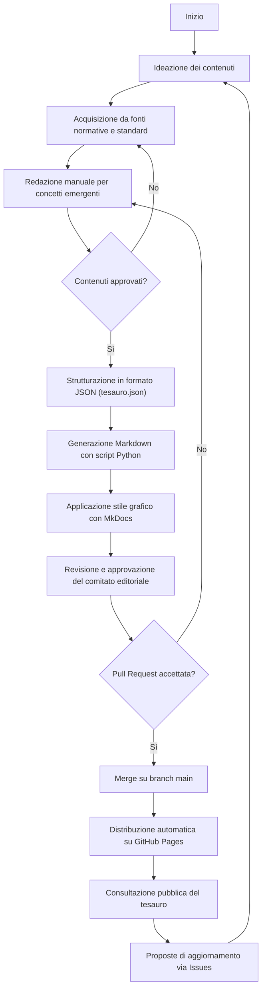

{width=100px height=100px}

# Tesauro bilingue sulla governance dell’intelligenza artificiale

[Link alla repository del progetto](https://github.com/mauritiuss/tesauro-ai)

## Introduzione

Il presente progetto, sviluppato nell’ambito del corso di *Editoria digitale*, ha come obiettivo la progettazione e realizzazione di un workflow editoriale per la gestione di un **tesauro bilingue (inglese-italiano) dedicato alla governance dell’intelligenza artificiale**.  

Il lavoro si concentra su tre aspetti fondamentali: 

- La scelta di un **formato sorgente strutturato** (JSON) capace di rappresentare termini, definizioni, relazioni semantiche e fonti normative;  
- La definizione di un **flusso di pubblicazione automatizzato**, basato su *MkDocs* e *GitHub Pages*, che garantisce aggiornabilità e accesso pubblico;  
- L’implementazione di un **processo editoriale trasparente e tracciabile**, supportato da template per *Issue* e *Pull Request*, linee guida di contributo e un sistema di versionamento (CHANGELOG + tag).  

Le tecnologie adottate (Python, GitHub Actions, MkDocs) hanno permesso di realizzare un sistema semplice ma efficace, in grado di unire la dimensione tecnica con quella editoriale.  

Il risultato è una piattaforma digitale che consente non solo la consultazione delle voci del tesauro, ma anche la partecipazione attiva degli utenti attraverso proposte di aggiornamento motivate e pubblicamente giustificate. In questo modo, il tesauro diventa uno strumento “vivo”, capace di seguire l’evoluzione terminologica dell’IA e di fornire un punto di riferimento trasparente e interdisciplinare.

## Ideazione

### Tema
Il tesauro bilingue affronta il tema della **governance dell’intelligenza artificiale**, un ambito caratterizzato da rapida evoluzione e da una forte necessità di chiarezza terminologica. I temi principali che il prodotto editoriale intende presentare sono:

- **Prospettiva normativa-giuridica**: terminologia derivata da regolamenti (es. AI Act europeo, DDL italiano 2025), convenzioni e standard internazionali.
- **Prospettiva tecnico-operativa**: concetti provenienti da standard ISO/IEC, dal NIST AI RMF e dalla pratica di sviluppo dei sistemi di IA.  
- **Prospettiva concettuale-filosofica**: nozioni emergenti come “IA agentica” o “autonomia degli agenti”, utili a comprendere l’evoluzione del dibattito etico e sociale.

### Destinatari

Il tesauro è pensato per un pubblico interdisciplinare che necessita di strumenti affidabili per orientarsi nel lessico della governance dell’IA. Per descrivere i destinatari si utilizza la tecnica delle **personas**, cioè profili rappresentativi di tipologie di utenti reali.

---

1. Persona 1 — *Giulia, Policy Maker*
   - **Profilo**: Funzionario del Ministero dello sviluppo Economico, 42 anni.
   - **Esigenze**: Comprende i termini tecnici presenti nei documenti normativi internazionali per adattarli al contesto legislativo italiano.  
   - **Scenario d'uso**: Giulia consulta il tesauro per verificare la coerenza terminologica tra il testo dell’AI Act europeo e il Disegno di Legge italiano del 2025, assicurandosi che la traduzione in italiano di concetti chiave sia uniforme.

---

2. Persona 2 — *Luca, Ingegnere AI*
   - **Profilo**: Ingegnere informatico in una startup di AI, 29 anni.  
   - **Esigenze**: Allineare la documentazione tecnica aziendale agli standard internazionali (ISO/IEC, NIST).  
   - **Scenario d’uso**: Luca utilizza il tesauro per trovare la traduzione corretta di *“risk-based approach”* e capisce come il termine è usato nel contesto delle normative e degli standard di settore, così da uniformare il manuale tecnico aziendale.

---

3. Persona 3 — *Sara, Ricercatrice di filosofia*
   - **Profilo**: Dottoranda in filosofia della tecnologia, 26 anni.  
   - **Esigenze**: analizzare le implicazioni etiche e concettuali di termini emergenti.  
   - **Scenario d’uso**: Sara consulta la voce *“IA agentica”* per esplorare le sue definizioni in inglese e in italiano, scoprendo anche i collegamenti semantici con concetti più ampi come *Artificial Intelligence* e le fonti normative in cui il termine è stato discusso.

---

4. Persona 4 — *Marco, Giornalista scientifico*
   - **Profilo**: Giornalista freelance specializzato in innovazione tecnologica, 35 anni.  
   - **Esigenze**: comunicare concetti complessi di IA a un pubblico generalista in modo chiaro e corretto.  
   - **Scenario d’uso**: Marco si affida al tesauro per scrivere un articolo sul dibattito internazionale riguardo alla *Generative AI*, utilizzando definizioni ufficiali e citando le fonti normative per rafforzare la credibilità del suo pezzo.

---

5. **Francesco, 50 anni, paziente con patologie croniche**
   - **Background**: Ha problemi di ipertensione e monitora la propria salute con uno smartwatch medico. È poco esperto di tecnologia.
   - **Obiettivi**: Monitorare parametri come la frequenza cardiaca e la temperatura corporea, evitando situazioni di rischio.
   - **Bisogni**: Interfaccia semplice e spiegazioni chiare sui dati, con indicazioni su quando è necessario consultare un medico.
   - **Scenario d'uso**:  Utilizza la WebApp per controllare i parametri vitali e si sente rassicurato dalla possibilità di accedere facilmente ai suoi dati.

---

### Sintesi
Queste personas mostrano come il tesauro possa essere utile a:  

- decisori politici (chiarezza normativa),  
- tecnici (coerenza con standard),  
- ricercatori e accademici (analisi concettuale),  
- divulgatori e giornalisti (comunicazione corretta).  

In questo modo, il prodotto editoriale risponde a esigenze diverse ma complementari, rafforzando la sua funzione di strumento interdisciplinare.

### Modello di fruizione

Per garantire l’efficacia del tesauro e la sua utilità per i destinatari individuati, sono stati definiti alcuni **requisiti di accettazione** e un modello di fruizione pensato per agevolare la consultazione interdisciplinare.

#### Requisiti di accettazione

- **Accessibilità online**: il tesauro deve essere disponibile come sito pubblico e navigabile.  
- **Aggiornabilità**: nuove voci devono poter essere aggiunte attraverso un processo chiaro e trasparente.  
- **Bilinguismo**: ogni voce deve includere sia la definizione in italiano sia quella in inglese.  
- **Tracciabilità**: tutte le modifiche devono essere documentate tramite versionamento e changelog.  
- **Partecipazione**: gli utenti devono poter proporre aggiornamenti e ricevere giustificazioni pubbliche delle decisioni editoriali.

#### Modelli di lettura e fruizione
- **Consultazione tematica**: ricerca di termini per ID o per parola chiave.  
- **Navigazione semantica**: esplorazione dei concetti attraverso relazioni *broader*, *narrower* e *related*.  
- **Filtro per lingua**: possibilità di visualizzare definizioni in italiano, inglese o entrambe.  
- **Allineamento normativo**: accesso diretto alle fonti (AI Act, ISO/IEC, NIST) collegate a ciascun termine.

#### Standard di riferimento
- **ISO/IEC 22989:2022** – Terminologia AI.  
- **ISO/IEC 23894:2023** – Gestione del rischio in sistemi di IA.  
- **NIST AI Risk Management Framework (2023)**.  
- **AI Act europeo (Reg. UE 1689/2024)** e normative nazionali.  

Questi standard garantiscono che la terminologia utilizzata sia coerente con documenti riconosciuti a livello internazionale.

#### Aspetti di innovazione
- **Processo di fruizione**: gli utenti non si limitano a leggere, ma possono partecipare attivamente con proposte di aggiornamento strutturate tramite template dedicati.  
- **Trasparenza editoriale**: ogni decisione (approvazione o rifiuto) è pubblicata e motivata.  
- **Aggiornabilità dinamica**: il workflow GitHub Actions consente di pubblicare automaticamente il sito a ogni modifica approvata.  
- **Documentazione viva**: grazie a *CHANGELOG* e *tag versioni*, lo storico rimane sempre accessibile e navigabile.  

In questo modo, il tesauro si configura non solo come un prodotto editoriale statico, ma come una piattaforma **collaborativa, tracciabile e innovativa**, in grado di evolvere insieme al linguaggio dell’intelligenza artificiale.

### Canali di distribuzione
Il tesauro è concepito come risorsa digitale multicanale, per raggiungere pubblici diversi e adattarsi a differenti contesti di fruizione.  

#### Canali principali
- **Web**: pubblicazione principale tramite sito statico generato con *MkDocs* e distribuito su *GitHub Pages*.  
- **Social**: condivisione di aggiornamenti e nuove versioni tramite canali istituzionali (es. LinkedIn o X/Twitter) per favorire la diffusione delle novità.  
- **Repository GitHub**: punto di riferimento per gli esperti e contributori, che possono accedere direttamente al sorgente (`tesauro.json`) e al flusso editoriale.  
- **Intranet accademica/istituzionale** (opzionale): possibile integrazione in contesti interni (università, enti di ricerca) come risorsa di riferimento per corsi o policy interne.  

#### Formati dati previsti
- **JSON**: formato sorgente, strutturato e leggibile dalle macchine.  
- **Markdown / WebBook**: formato di consultazione, ottimizzato per il web.  
- **PDF** (generabile da MkDocs): per distribuzione offline e archiviazione istituzionale.

#### Identità visuale e stile tipografico
- **Tipografia**: caratteri sans-serif leggibili sul web (es. *Roboto*, *Inter*) con utilizzo di titoli ben gerarchizzati (H1, H2, H3).  
- **Colori e layout**: interfaccia minimale, con palette neutra, per mettere in risalto il contenuto testuale.  
- **Stile redazionale**:  
  - Tono **formale e professionale**, adatto a documenti normativi e scientifici;  
  - Uso coerente di termini bilingui (IT/EN);  
  - Citazione sistematica delle fonti.

In questo modo, il tesauro assume un’identità editoriale chiara e affidabile, comunicando rigore formale nei contenuti e innovazione nei processi di gestione.

## Processo di Produzione

### Acquisizione dei contenuti

La costruzione del tesauro si basa su un insieme selezionato di fonti normative, standard tecnici e documenti concettuali. La scelta delle fonti tiene conto sia della loro rilevanza scientifica e istituzionale, sia del costo di acquisizione in termini di tempo e risorse.

#### Fonti libere e disponibili pubblicamente
- **AI Act europeo (Reg. UE 1689/2024)**: testo legislativo disponibile in formato digitale multilingue sul portale EUR-Lex.  
- **Convenzione quadro del Consiglio d’Europa sull’IA**: documento accessibile gratuitamente sul sito del Consiglio d’Europa.  
- **GPAI Codes of Practice**: linee guida rese disponibili pubblicamente dal partenariato globale sull’IA.  
- **NIST AI Risk Management Framework (2023)**: pubblicato in modalità open access.  

Queste fonti costituiscono la base normativa e policy del tesauro, senza costi diretti di acquisizione.

#### Fonti standard internazionali (parzialmente a pagamento)
- **ISO/IEC 22989:2022** (terminologia AI).  
- **ISO/IEC 23894:2023** (gestione del rischio nei sistemi di IA).  

Questi standard sono di riferimento imprescindibile, ma la loro acquisizione comporta un costo economico. L’integrazione nel tesauro avviene selezionando i concetti chiave, nel rispetto delle licenze di utilizzo.

#### Contenuti generabili automaticamente
- **Metadati di traduzione bilingue**: parte delle traduzioni inglese-italiano può essere supportata da strumenti di traduzione assistita (CAT tools), che velocizzano il processo mantenendo la coerenza terminologica.  
- **Estratti da documenti pubblici**: l’uso di parser per documenti in XML/HTML consente di importare automaticamente definizioni e riferimenti normativi.

#### Contenuti da redigere manualmente
- **Concetti emergenti** (es. *IA agentica*, *IA generativa*): non sempre presenti in fonti istituzionali, richiedono un lavoro di definizione e contestualizzazione redazionale.  
- **Relazioni semantiche (broader, narrower, related)**: la classificazione non è automatizzabile in modo affidabile e deve essere validata editorialmente.  
- **Note esplicative e giustificazioni**: ogni decisione editoriale (approvazione, rifiuto, modifica) viene redatta manualmente dal comitato e pubblicata a beneficio degli utenti.

Questo approccio ibrido assicura al tesauro sia **rigore istituzionale**, sia **flessibilità innovativa** nell’inclusione di concetti nuovi.

### Gestione documentale
Il flusso di gestione documentale del tesauro è stato progettato per garantire **trasparenza, aggiornabilità e tracciabilità** in ogni fase del processo. Le principali tappe sono:

1. **Ideazione**: Identificazione dei concetti e dei termini più rilevanti per la governance dell’intelligenza artificiale, sulla base delle esigenze emerse dalle *personas* (policy maker, ingegneri, ricercatori, giornalisti). Questa fase ha permesso di selezionare i contenuti che avrebbero avuto maggiore utilità per gli utenti finali.
2. **Acquisizione dei contenuti**: Raccolta delle informazioni da fonti normative, standard internazionali e documenti scientifici. In particolare: AI Act europeo, Convenzione del Consiglio d’Europa, GPAI Codes of Practice, NIST AI RMF e standard ISO/IEC. Sono stati inclusi anche concetti emergenti (es. *IA agentica*, *IA generativa*) tramite lavoro redazionale.
3. **Valutazione dei diritti**: Classificazione delle fonti in base ai vincoli di utilizzo:  
   - fonti **libere e open access** (es. AI Act, NIST RMF),  
   - fonti **a pagamento con licenza** (ISO/IEC),  
   - contenuti **redatti manualmente** (concetti filosofici o emergenti).  
   Questo garantisce il rispetto delle regole di copyright e citazione.
4. **Strutturazione dei contenuti**: Organizzazione dei termini nel formato sorgente **JSON** (`tesauro.json`). Ogni voce include ID, definizione bilingue, fonti, relazioni semantiche (*broader*, *narrower*, *related*) e varianti terminologiche. Questa fase assicura coerenza e uniformità nella rappresentazione dei dati.
5. **Trasformazione dei formati**: Attraverso lo script Python `generate_docs.py`, i contenuti JSON vengono trasformati automaticamente in file **Markdown** (`docs/terms/AIxxx.md`) e in un indice di consultazione. Questo passaggio permette la creazione di una documentazione navigabile e facilmente pubblicabile.
6. **Applicazione dello stile grafico**: Utilizzo del framework **MkDocs** per pubblicare il tesauro come sito statico. Sono state adottate scelte di identità visiva sobrie (tipografia sans-serif, layout minimale, gerarchie di titoli chiare) per privilegiare la leggibilità dei testi e la consultazione rapida.
7. **Generazione dei metadati**: Aggiunta di informazioni complementari (ID univoco, relazioni semantiche, fonti normative, varianti) sia all’interno delle voci sia nel versionamento GitHub (storico commit, changelog, tag). I metadati garantiscono tracciabilità e trasparenza editoriale.
8. **Revisione e approvazione**: Ogni proposta di modifica viene presentata tramite **Issue** con motivazioni e fonti obbligatorie. Il comitato editoriale valuta, approva o rifiuta le modifiche, fornendo una giustificazione pubblica. Le modifiche approvate generano una **Pull Request**, che viene verificata e fusa nel branch `main`.
9. **Distribuzione dei contenuti**: La pubblicazione avviene tramite **GitHub Pages**, che aggiorna automaticamente il sito a ogni modifica del branch principale. In questo modo, il tesauro rimane sempre aggiornato e accessibile pubblicamente.

### Tecnologie adottate
Lo sviluppo del tesauro ha richiesto l’integrazione di diverse tecnologie, ciascuna delle quali ha contribuito a raggiungere gli obiettivi descritti negli scenari d’uso.

| Tecnologia       | Fase di utilizzo                                | Contributo | Scenari supportati |
|------------------|-------------------------------------------------|------------|---------------------|
| **JSON**         | Formato sorgente per le voci del tesauro         | Strutturazione dei dati (ID, definizioni IT/EN, fonti, relazioni) | Policy maker (uniformità terminologica); Ingegneri (integrazione tecnica) |
| **Python**       | Generazione automatica dei file Markdown         | Automazione, riduzione errori, aggiornamenti rapidi | Ricercatori (consultazione strutturata); Giornalisti (definizioni aggiornate) |
| **Markdown**     | Rappresentazione dei contenuti editoriali        | Facilità di scrittura e leggibilità umana | Tutti i destinatari (accessibilità dei testi) |
| **MkDocs**       | Pubblicazione del sito statico                   | Interfaccia web chiara, responsive e navigabile | Tutti i destinatari (consultazione online) |
| **GitHub Pages** | Hosting e distribuzione automatica               | Aggiornamento continuo e accesso pubblico | Tutti i destinatari (fruizione aperta e gratuita) |
| **Git + GitHub** | Versionamento, collaborazione, workflow editoriale | Tracciabilità storica, Issues e Pull Request per feedback | Comitato editoriale (approvazione/rifiuto modifiche) |
| **Template Issues/PR** | Raccolta feedback e proposte di aggiornamento | Trasparenza, motivazioni obbligatorie, giustificazioni pubbliche | Contributori esterni, revisori |
| **CHANGELOG + Tag** | Documentazione delle versioni                  | Storico chiaro delle modifiche con semver | Tutti i destinatari (monitoraggio evoluzioni) |
| **Tema MkDocs**  | Identità visuale e tipografia                    | Layout sobrio, font leggibili, gerarchie di titoli | Tutti i destinatari (esperienza di lettura) |

### Esecuzione del flusso
Tutti i materiali, script e configurazioni necessari per riprodurre il flusso di produzione documentale sono disponibili nel repository GitHub associato al progetto disponibile a questo [link](https://github.com/mauritiuss/health-dashboard).

## Valutazione dei risultati raggiunti

### Valutazione del flusso di produzione

Il flusso di produzione adottato ha consentito di ottenere risultati significativi in termini di efficienza, qualità e scalabilità:

1. **Riduzione dei tempi di sviluppo e gestione**: L’integrazione di strumenti moderni come **React** per la creazione della WebApp e **GitHub** per la gestione del versionamento ha reso possibile una gestione snella e strutturata del progetto.
2. **Minimizzazione degli errori**: La fase di acquisizione dei contenuti è stata supportata dall’intelligenza artificiale, con il modello **GPT-4**, che ha fornito testi chiari e coerenti basati su fonti affidabili. La revisione effettuata da **esperti medici** ha permesso di validare i contenuti, correggere eventuali imprecisioni e garantire la qualità scientifica delle informazioni fornite.
3. **Miglioramento della qualità dei contenuti e della presentazione**: L’adozione di **Semantic UI** per la creazione dell’interfaccia grafica e di **Recharts** per la visualizzazione dei dati ha reso la WebApp non solo funzionale, ma anche esteticamente curata e user-friendly. Questo approccio ha contribuito a migliorare la leggibilità e l’interattività dei contenuti.
4. **Flessibilità e adattabilità a nuovi scenari d’uso**: Il flusso adottato è altamente scalabile e riutilizzabile. Le tecnologie impiegate sono standard del settore, facilmente aggiornabili e adattabili a nuove esigenze editoriali.
5. **Accessibilità e ampia diffusione**: Grazie alla natura web-based del prodotto, il contenuto è facilmente accessibile da qualsiasi dispositivo connesso a Internet. L’utilizzo di componenti responsive garantisce una fruizione ottimale anche su dispositivi mobili, ampliando il potenziale bacino di utenti.

### Confronto con lo stato dell'arte

Le tecnologie adottate in questo progetto sono state scelte per garantire un flusso di lavoro efficace, scalabile e facilmente aggiornabile. L’uso di **React** per la creazione della WebApp, insieme a **GitHub** per il versionamento, ha permesso una gestione collaborativa strutturata, assicurando il controllo delle modifiche e la tracciabilità del codice.

Rispetto a metodi più tradizionali, come la produzione di documenti statici (es. **PDF**), questa soluzione offre vantaggi significativi: ogni aggiornamento dei contenuti richiede semplicemente un commit e un push su GitHub, rendendo disponibili le modifiche in tempo reale, senza necessità di ridistribuire manualmente il prodotto.

Inoltre, la combinazione tra intelligenza artificiale (**GPT-4**) per l’acquisizione dei contenuti e la revisione da parte di **esperti medici** ha garantito una produzione rapida, precisa e scientificamente validata. Questo approccio innovativo ha reso possibile la creazione di contenuti aggiornati, affidabili e facilmente accessibili tramite una WebApp responsive, utilizzabile da qualsiasi dispositivo connesso a Internet.

### Limiti emersi
Nonostante l’efficacia del flusso di lavoro e delle tecnologie adottate, sono emersi alcuni limiti legati soprattutto alla gestione e alla personalizzazione del prodotto finale.

L’uso di una **WebApp basata su React** richiede una connessione Internet costante per accedere ai contenuti, il che può rappresentare un limite in contesti con scarsa connettività. Tuttavia, considerando che la maggior parte delle piattaforme digitali moderne richiedono comunque una connessione di rete, questo aspetto risulta marginale.

Un’altra criticità riguarda la personalizzazione grafica: pur avendo utilizzato librerie come **Semantic UI** e **Recharts** per garantire una UI chiara e grafici interattivi, le possibilità di design rimangono comunque vincolate alle opzioni offerte da queste librerie.

Infine, l’affidamento all’intelligenza artificiale (**GPT-4**) per l’acquisizione dei contenuti, sebbene efficace, ha richiesto una **revisione approfondita da parte di esperti medici** per garantire la correttezza e l’affidabilità delle informazioni. Questo passaggio ha introdotto tempistiche aggiuntive, inevitabili però per assicurare la qualità del prodotto finale.
 
## Conclusioni
In conclusione, gli obiettivi principali del progetto sono stati pienamente raggiunti, grazie a un flusso di lavoro ben strutturato e all’uso di tecnologie adeguate. Vediamo nel dettaglio:

- **Raccolta e validazione dei contenuti**: L’utilizzo di **GPT-4** ha permesso di acquisire rapidamente informazioni utili e pertinenti, che sono state poi sottoposte alla revisione di **esperti medici**. Questo ha garantito un equilibrio tra velocità di produzione e accuratezza scientifica.
- **Gestione del versioning e aggiornamenti**: L’integrazione con **GitHub** ha reso semplice la gestione delle versioni del progetto, permettendo un controllo preciso delle modifiche.
- **Sviluppo di una WebApp moderna**: La scelta di **React** come framework di sviluppo ha consentito la realizzazione di un’interfaccia dinamica e interattiva, offrendo un’esperienza utente fluida e intuitiva. L’uso di librerie come **Semantic UI** e **Recharts** ha permesso di creare componenti grafici chiari e visualizzazioni dei dati efficaci.

## Bibliografia e sitografia

Di seguito tutte le fonti usate nella progettazione del prodotto editoriale digitale:

1. **Corriere della Sera – Salute, 2023**: "Il numero di passi giornalieri ideale"  
   [leggi di più](https://www.corriere.it/salute/cardiologia/23_novembre_07/numero-passi-giornalieri-ideale-c0b4e77c-7c96-11ee-90f0-2d45ce928adc.shtml)

2. **Kosuke Inoue, Amanda E. Paluch, 2023**: "Daily Step Counts and Mortality and Cardiovascular Events: A Meta-Analysis"  
   [leggi di più](https://www.sciencedirect.com/science/article/pii/S0735109723064008)

3. **Healthy The Wom, 2023**: "Frequenza cardiaca: cosa è normale e cosa no"  
   [leggi di più](https://healthy.thewom.it/esami-e-analisi/frequenza-cardiaca/)

4. **Humana Vox, 2023**: "Battito cardiaco: valori normali e quando preoccuparsi"  
   [leggi di più](https://www.humanavox.it/battito-cardiaco/)

5. **Livello Salute, 2023**: "Quanti battiti cardiaci sono normali per stare bene"  
   [leggi di più](https://www.livellosalute.it/fitness/battiti-cardiaci-quanti-devono-essere-per-stare-bene/)

6. **Microbiologia Italia, 2024**: "I benefici del sonno per la salute mentale"  
   [leggi di più](https://www.microbiologiaitalia.it/salute/i-benefici-del-sonno-per-la-salute-mentale/)

7. **Microbiologia Italia, 2024**: "L’Importanza del Sonno: Riposo di Qualità per una Vita più Sana"  
   [leggi di più](https://www.microbiologiaitalia.it/benessere/riposo-di-qualita/)

8. **Interlab Analisi, 2024**: "Il sonno e la salute: perché dormire bene è fondamentale"  
   [leggi di più](https://interlabanalisi.it/il-sonno-e-la-salute-perche-dormire-bene-e-importante/)

9. **Rete HPH Italia, 2024**: "L’Impatto del sonno sulla salute: un’analisi approfondita"  
   [leggi di più](https://www.retehphitalia.it/limpatto-del-sonno-sulla-salute-unanalisi-approfondita/)

10. **Guida Psicologi, 2024**: "L’importanza del sonno di qualità: perché dovremmo riposare bene?"  
   [leggi di più](https://www.guidapsicologi.it/articoli/limportanza-del-sonno-perche-dovremmo-riposare-bene?)

11. **VEb.it, 2024**: "Il Potere del Sonno: Perché Dormire Bene è Essenziale per la Salute Mentale e Fisica"  
   [leggi di più](https://www.veb.it/il-potere-del-sonno-perche-dormire-bene-e-essenziale-per-la-salute-mentale-e-fisica-119477?)

12. **Nurse24 - Elvira La Montagna, 2022**: "Temperatura corporea e i diversi tipi di Febbre"  
   [Leggi di più]( https://www.nurse24.it/infermiere/utility/temperatura-corporea.html)

13. **Salus, 2024**: "L’importanza della temperatura corporea e della termoregolazione"  
   [Leggi di più](https://www.salus.it/limportanza-della-temperatura-corporea-e-della-termoregolazione)

14. **BiologiaWiki - Crisafulli, 2024**: "Regolazione della temperatura corporea - Termoregolazione - fisiologia"  
   [Leggi di più](https://biologiawiki.it/wiki/regolazione-della-temperatura-corporea)