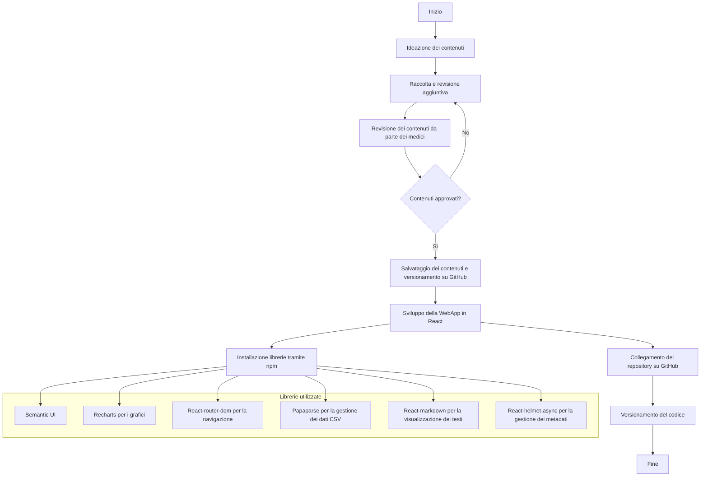

{width=100px height=100px}

# # Tesauro bilingue sulla governance dell’intelligenza artificiale

[Link alla repository del progetto](https://github.com/mauritiuss/tesauro-ai)

## Introduzione

Il presente progetto, sviluppato nell’ambito del corso di *Editoria digitale*, ha come obiettivo la progettazione e realizzazione di un workflow editoriale per la gestione di un **tesauro bilingue (inglese-italiano) dedicato alla governance dell’intelligenza artificiale**.  

Il lavoro si concentra su tre aspetti fondamentali: 

- La scelta di un **formato sorgente strutturato** (JSON) capace di rappresentare termini, definizioni, relazioni semantiche e fonti normative;  
- La definizione di un **flusso di pubblicazione automatizzato**, basato su *MkDocs* e *GitHub Pages*, che garantisce aggiornabilità e accesso pubblico;  
- L’implementazione di un **processo editoriale trasparente e tracciabile**, supportato da template per *Issue* e *Pull Request*, linee guida di contributo e un sistema di versionamento (CHANGELOG + tag).  

Le tecnologie adottate (Python, GitHub Actions, MkDocs) hanno permesso di realizzare un sistema semplice ma efficace, in grado di unire la dimensione tecnica con quella editoriale.  

Il risultato è una piattaforma digitale che consente non solo la consultazione delle voci del tesauro, ma anche la partecipazione attiva degli utenti attraverso proposte di aggiornamento motivate e pubblicamente giustificate. In questo modo, il tesauro diventa uno strumento “vivo”, capace di seguire l’evoluzione terminologica dell’IA e di fornire un punto di riferimento trasparente e interdisciplinare.

## Ideazione

### Tema
Il tesauro bilingue affronta il tema della **governance dell’intelligenza artificiale**, un ambito caratterizzato da rapida evoluzione e da una forte necessità di chiarezza terminologica. I temi principali che il prodotto editoriale intende presentare sono:

- **Prospettiva normativa-giuridica**: terminologia derivata da regolamenti (es. AI Act europeo, DDL italiano 2025), convenzioni e standard internazionali.
- **Prospettiva tecnico-operativa**: concetti provenienti da standard ISO/IEC, dal NIST AI RMF e dalla pratica di sviluppo dei sistemi di IA.  
- **Prospettiva concettuale-filosofica**: nozioni emergenti come “IA agentica” o “autonomia degli agenti”, utili a comprendere l’evoluzione del dibattito etico e sociale.

### Destinatari

Il tesauro è pensato per un pubblico interdisciplinare che necessita di strumenti affidabili per orientarsi nel lessico della governance dell’IA. Per descrivere i destinatari si utilizza la tecnica delle **personas**, cioè profili rappresentativi di tipologie di utenti reali.

---

1. Persona 1 — *Giulia, Policy Maker*
   - **Profilo**: Funzionario del Ministero dello sviluppo Economico, 42 anni.
   - **Esigenze**: Comprende i termini tecnici presenti nei documenti normativi internazionali per adattarli al contesto legislativo italiano.  
   - **Scenario d'uso**: Giulia consulta il tesauro per verificare la coerenza terminologica tra il testo dell’AI Act europeo e il Disegno di Legge italiano del 2025, assicurandosi che la traduzione in italiano di concetti chiave sia uniforme.

---

2. Persona 2 — *Luca, Ingegnere AI*
   - **Profilo**: Ingegnere informatico in una startup di AI, 29 anni.  
   - **Esigenze**: Allineare la documentazione tecnica aziendale agli standard internazionali (ISO/IEC, NIST).  
   - **Scenario d’uso**: Luca utilizza il tesauro per trovare la traduzione corretta di *“risk-based approach”* e capisce come il termine è usato nel contesto delle normative e degli standard di settore, così da uniformare il manuale tecnico aziendale.

---

3. Persona 3 — *Sara, Ricercatrice di filosofia*
   - **Profilo**: Dottoranda in filosofia della tecnologia, 26 anni.  
   - **Esigenze**: analizzare le implicazioni etiche e concettuali di termini emergenti.  
   - **Scenario d’uso**: Sara consulta la voce *“IA agentica”* per esplorare le sue definizioni in inglese e in italiano, scoprendo anche i collegamenti semantici con concetti più ampi come *Artificial Intelligence* e le fonti normative in cui il termine è stato discusso.

---

4. Persona 4 — *Marco, Giornalista scientifico*
   - **Profilo**: Giornalista freelance specializzato in innovazione tecnologica, 35 anni.  
   - **Esigenze**: comunicare concetti complessi di IA a un pubblico generalista in modo chiaro e corretto.  
   - **Scenario d’uso**: Marco si affida al tesauro per scrivere un articolo sul dibattito internazionale riguardo alla *Generative AI*, utilizzando definizioni ufficiali e citando le fonti normative per rafforzare la credibilità del suo pezzo.

---

5. **Francesco, 50 anni, paziente con patologie croniche**
   - **Background**: Ha problemi di ipertensione e monitora la propria salute con uno smartwatch medico. È poco esperto di tecnologia.
   - **Obiettivi**: Monitorare parametri come la frequenza cardiaca e la temperatura corporea, evitando situazioni di rischio.
   - **Bisogni**: Interfaccia semplice e spiegazioni chiare sui dati, con indicazioni su quando è necessario consultare un medico.
   - **Scenario d'uso**:  Utilizza la WebApp per controllare i parametri vitali e si sente rassicurato dalla possibilità di accedere facilmente ai suoi dati.

---

### Sintesi
Queste personas mostrano come il tesauro possa essere utile a:  

- decisori politici (chiarezza normativa),  
- tecnici (coerenza con standard),  
- ricercatori e accademici (analisi concettuale),  
- divulgatori e giornalisti (comunicazione corretta).  

In questo modo, il prodotto editoriale risponde a esigenze diverse ma complementari, rafforzando la sua funzione di strumento interdisciplinare.

### Modello di fruizione

Per garantire l’efficacia del tesauro e la sua utilità per i destinatari individuati, sono stati definiti alcuni **requisiti di accettazione** e un modello di fruizione pensato per agevolare la consultazione interdisciplinare.

#### Requisiti di accettazione

- **Accessibilità online**: il tesauro deve essere disponibile come sito pubblico e navigabile.  
- **Aggiornabilità**: nuove voci devono poter essere aggiunte attraverso un processo chiaro e trasparente.  
- **Bilinguismo**: ogni voce deve includere sia la definizione in italiano sia quella in inglese.  
- **Tracciabilità**: tutte le modifiche devono essere documentate tramite versionamento e changelog.  
- **Partecipazione**: gli utenti devono poter proporre aggiornamenti e ricevere giustificazioni pubbliche delle decisioni editoriali.

#### Modelli di lettura e fruizione
- **Consultazione tematica**: ricerca di termini per ID o per parola chiave.  
- **Navigazione semantica**: esplorazione dei concetti attraverso relazioni *broader*, *narrower* e *related*.  
- **Filtro per lingua**: possibilità di visualizzare definizioni in italiano, inglese o entrambe.  
- **Allineamento normativo**: accesso diretto alle fonti (AI Act, ISO/IEC, NIST) collegate a ciascun termine.

#### Standard di riferimento
- **ISO/IEC 22989:2022** – Terminologia AI.  
- **ISO/IEC 23894:2023** – Gestione del rischio in sistemi di IA.  
- **NIST AI Risk Management Framework (2023)**.  
- **AI Act europeo (Reg. UE 1689/2024)** e normative nazionali.  

Questi standard garantiscono che la terminologia utilizzata sia coerente con documenti riconosciuti a livello internazionale.

#### Aspetti di innovazione
- **Processo di fruizione**: gli utenti non si limitano a leggere, ma possono partecipare attivamente con proposte di aggiornamento strutturate tramite template dedicati.  
- **Trasparenza editoriale**: ogni decisione (approvazione o rifiuto) è pubblicata e motivata.  
- **Aggiornabilità dinamica**: il workflow GitHub Actions consente di pubblicare automaticamente il sito a ogni modifica approvata.  
- **Documentazione viva**: grazie a *CHANGELOG* e *tag versioni*, lo storico rimane sempre accessibile e navigabile.  

In questo modo, il tesauro si configura non solo come un prodotto editoriale statico, ma come una piattaforma **collaborativa, tracciabile e innovativa**, in grado di evolvere insieme al linguaggio dell’intelligenza artificiale.

### Canali di distribuzione
Per distribuire il prodotto editoriale digitale, si prevede l'utilizzo di:

- **Web**: La WebApp sarà il canale principale, accessibile da qualsiasi browser senza bisogno di installare applicazioni aggiuntive.

L’identità visuale seguirà uno stile moderno, chiaro e professionale, con un design minimale che favorisca la leggibilità e l’usabilità. 
Per lo sviluppo grafico, ci siamo affidati a **Semantic UI**, una libreria front-end che offre componenti predefiniti eleganti e facilmente personalizzabili. Questo ha permesso di mantenere una coerenza visiva, con elementi ben strutturati e intuitivi.
Per la rappresentazione dei dati, abbiamo scelto la libreria **Recharts**, che consente di creare grafici dinamici e interattivi (a barre, linee, torte) offrendo una visualizzazione immediata e comprensibile dei parametri monitorati.

Inoltre:

- **Colori**: Palette sobria con tonalità neutre e accenti di colore per evidenziare dati importanti (es.: verde per valori nella norma, rosso per anomalie).
- **Icone**: Anche per le icone, abbiamo utilizzato Semantic UI, garantendo uno stile coerente e riconoscibile in tutta la WebApp.

L’obiettivo è bilanciare innovazione e familiarità:

- **Adesione a modelli conosciuti**: La struttura della WebApp richiama dashboard di monitoraggio già note, facilitando la navigazione intuitiva.
- **Innovazione**: La personalizzazione avanzata dei report e la visualizzazione dinamica dei dati tramite grafici interattivi rendono l’esperienza più coinvolgente rispetto ai report tradizionali statici (come PDF).

## Processo di Produzione

### Acquisizione dei contenuti

L'acquisizione dei contenuti è avvenuta attraverso un approccio misto.

La fase iniziale di generazione del testo e ricerca delle fonti è stata svolta tramite l’intelligenza artificiale, utilizzando **ChatGPT basato sul modello GPT-4**. Questo modello avanzato, sviluppato da OpenAI, è stato scelto per la sua capacità di produrre testi coerenti, pertinenti e ben strutturati.

Successivamente, il contenuto è stato sottoposto a una revisione manuale da parte di esperti medici, con l’obiettivo di garantire un’elevata qualità, integrare eventuali informazioni mancanti e verificare l’accuratezza delle fonti utilizzate.

Quando le fonti originali si sono rivelate insufficienti o poco precise, sono state selezionate ulteriori risorse affidabili per completare il processo di acquisizione dei contenuti in modo rigoroso e attendibile.

Spiegazione del modello adottato:

- **GPT-4**: Si tratta di un modello di linguaggio di ultima generazione sviluppato da OpenAI, noto per la sua capacità di comprendere il contesto e produrre risposte dettagliate e accurate. È stato scelto per la sua particolare efficacia nella generazione di testi complessi, supportando attività come la scrittura creativa, la revisione e l’elaborazione di contenuti tecnici. Questa tecnologia si è rivelata fondamentale nella fase iniziale di raccolta e strutturazione delle informazioni.

L’approccio combinato tra l’utilizzo dell’intelligenza artificiale per il reperimento delle fonti e la revisione da parte di medici esperti ha permesso di offrire agli utenti informazioni accurate, complete e di alto valore.

### Gestione documentale
Il flusso di gestione documentale si compone delle seguenti fasi:

1. **Ideazione**: Identificazione dei contenuti più comuni e significativi in base alle esigenze emerse dalle *personas* definite. Questa fase ha permesso di stabilire quali dati e informazioni sarebbero stati più utili e rilevanti per gli utenti finali.
2. **Acquisizione dei contenuti**: Raccolta delle informazioni tramite intelligenza artificiale, utilizzando **ChatGPT basato sul modello GPT-4**. L’AI è stata impiegata per reperire studi scientifici e dati utili riguardanti i parametri di monitoraggio della salute, come passi giornalieri, frequenza cardiaca, ore di sonno e temperatura corporea.
3. **Revisione dei contenuti**: Le informazioni raccolte tramite l’AI sono state sottoposte a una revisione manuale da parte di medici esperti. Questo passaggio ha garantito l’accuratezza, la coerenza e l’affidabilità dei dati, integrando o correggendo eventuali inesattezze fornite dall’intelligenza artificiale.
4. **Sviluppo della WebApp**: Creazione della WebApp utilizzando **React**. Questa tecnologia è stata scelta per la sua flessibilità, la capacità di creare interfacce dinamiche e l’ampio supporto della community di sviluppatori.
5. **Gestione del versionamento**: Collegamento del repository del progetto a **GitHub**, in modo da gestire in modo efficiente il versionamento del codice e facilitare la collaborazione e il monitoraggio delle modifiche.
6. **Implementazione delle librerie**: Installazione e utilizzo delle librerie necessarie tramite **npm**, per garantire una corretta scrittura del codice e un’interfaccia intuitiva e responsive. Le librerie adottate sono state:
   - **Semantic UI** per la progettazione dell’interfaccia grafica.
   - **Vite** per la creazione rapida del progetto React.
   - **Papaparse** per la gestione e l’elaborazione dei file CSV.
   - **React-router-dom** per la navigazione tra le diverse pagine della WebApp.
   - **Recharts** per la visualizzazione dei dati attraverso grafici chiari e interattivi.
   - **React-markdown** per il rendering dei testi in formato markdown.
   - **React-helmet-async** per gestire in modo dinamico i metadati delle pagine, come titolo, descrizione e parole chiave.
7. **Salvataggio e aggiornamento**: Ogni modifica e aggiornamento dei contenuti e del codice è stato salvato e versionato tramite GitHub, garantendo una gestione ordinata e tracciabile dello sviluppo del progetto.

### Tecnologie adottate
Le tecnologie utilizzate sono state selezionate per garantire l'efficacia e la qualità delle diverse fasi del progetto, offrendo strumenti adeguati sia per la creazione dei contenuti che per la loro gestione e distribuzione. Ecco una panoramica delle tecnologie principali e del loro contributo:

| **Tecnologia**  | **Contributo principale** |
|-----------------|---------------------------|
| **React** | **Sviluppo della WebApp.** React è stato scelto per la sua efficienza nella creazione di interfacce dinamiche e responsive. Grazie alla sua architettura basata su componenti, ha permesso di costruire un’app modulare e facilmente manutenibile. |
| **GitHub**    | **Gestione del repository e del versioning.** GitHub è stato utilizzato per il controllo della versione del progetto, consentendo una gestione efficace del codice. |
| **Semantic UI** | **Interfaccia grafica e stile visivo.** Questo framework è stato utilizzato per creare un design moderno e coerente, offrendo componenti UI predefiniti per una WebApp responsive e intuitiva. |
| **Recharts**   | **Creazione di grafici interattivi.** Questa libreria è stata utilizzata per visualizzare dati in modo chiaro e intuitivo, offrendo grafici personalizzabili e reattivi. |
| **react-router-dom** | **Gestione della navigazione.**  È stato utilizzato per implementare un sistema di routing dinamico, permettendo la navigazione fluida tra le diverse sezioni della WebApp. |
| **Papaparse** | **Gestione dei file CSV.** Questa libreria ha semplificato l’importazione e l’elaborazione dei dati provenienti da file CSV, rendendo efficiente la lettura e la trasformazione dei dati strutturati. |
| **react-markdown** | **Visualizzazione di contenuti testuali.** È stata utilizzata per convertire il contenuto dei testi in formato Markdown, garantendo una resa leggibile direttamente nella WebApp. |
| **react-helmet-async** | **Gestione dei metadati delle pagine.** Questa libreria è stata utilizzata per definire i metadati di ogni pagina della WebApp, come titolo, charset, viewport e descrizione. Sebbene la WebApp sia destinata agli utenti e non indicizzata dai motori di ricerca, questi metadati migliorano l’organizzazione interna, la chiarezza delle informazioni e l'ottimizzazione della visualizzazione su diversi dispositivi. Questo approccio ha facilitato l'organizzazione dei contenuti, garantendo coerenza tra i diversi file.|
| **GPT-4** | **Acquisizione e generazione dei contenuti.** Il modello di intelligenza artificiale GPT-4 di OpenAI è stato impiegato per raccogliere informazioni e generare testi chiari, coerenti e pertinenti. |

### Esecuzione del flusso
Tutti i materiali, script e configurazioni necessari per riprodurre il flusso di produzione documentale sono disponibili nel repository GitHub associato al progetto disponibile a questo [link](https://github.com/mauritiuss/health-dashboard).

## Valutazione dei risultati raggiunti

### Valutazione del flusso di produzione

Il flusso di produzione adottato ha consentito di ottenere risultati significativi in termini di efficienza, qualità e scalabilità:

1. **Riduzione dei tempi di sviluppo e gestione**: L’integrazione di strumenti moderni come **React** per la creazione della WebApp e **GitHub** per la gestione del versionamento ha reso possibile una gestione snella e strutturata del progetto.
2. **Minimizzazione degli errori**: La fase di acquisizione dei contenuti è stata supportata dall’intelligenza artificiale, con il modello **GPT-4**, che ha fornito testi chiari e coerenti basati su fonti affidabili. La revisione effettuata da **esperti medici** ha permesso di validare i contenuti, correggere eventuali imprecisioni e garantire la qualità scientifica delle informazioni fornite.
3. **Miglioramento della qualità dei contenuti e della presentazione**: L’adozione di **Semantic UI** per la creazione dell’interfaccia grafica e di **Recharts** per la visualizzazione dei dati ha reso la WebApp non solo funzionale, ma anche esteticamente curata e user-friendly. Questo approccio ha contribuito a migliorare la leggibilità e l’interattività dei contenuti.
4. **Flessibilità e adattabilità a nuovi scenari d’uso**: Il flusso adottato è altamente scalabile e riutilizzabile. Le tecnologie impiegate sono standard del settore, facilmente aggiornabili e adattabili a nuove esigenze editoriali.
5. **Accessibilità e ampia diffusione**: Grazie alla natura web-based del prodotto, il contenuto è facilmente accessibile da qualsiasi dispositivo connesso a Internet. L’utilizzo di componenti responsive garantisce una fruizione ottimale anche su dispositivi mobili, ampliando il potenziale bacino di utenti.

### Confronto con lo stato dell'arte

Le tecnologie adottate in questo progetto sono state scelte per garantire un flusso di lavoro efficace, scalabile e facilmente aggiornabile. L’uso di **React** per la creazione della WebApp, insieme a **GitHub** per il versionamento, ha permesso una gestione collaborativa strutturata, assicurando il controllo delle modifiche e la tracciabilità del codice.

Rispetto a metodi più tradizionali, come la produzione di documenti statici (es. **PDF**), questa soluzione offre vantaggi significativi: ogni aggiornamento dei contenuti richiede semplicemente un commit e un push su GitHub, rendendo disponibili le modifiche in tempo reale, senza necessità di ridistribuire manualmente il prodotto.

Inoltre, la combinazione tra intelligenza artificiale (**GPT-4**) per l’acquisizione dei contenuti e la revisione da parte di **esperti medici** ha garantito una produzione rapida, precisa e scientificamente validata. Questo approccio innovativo ha reso possibile la creazione di contenuti aggiornati, affidabili e facilmente accessibili tramite una WebApp responsive, utilizzabile da qualsiasi dispositivo connesso a Internet.

### Limiti emersi
Nonostante l’efficacia del flusso di lavoro e delle tecnologie adottate, sono emersi alcuni limiti legati soprattutto alla gestione e alla personalizzazione del prodotto finale.

L’uso di una **WebApp basata su React** richiede una connessione Internet costante per accedere ai contenuti, il che può rappresentare un limite in contesti con scarsa connettività. Tuttavia, considerando che la maggior parte delle piattaforme digitali moderne richiedono comunque una connessione di rete, questo aspetto risulta marginale.

Un’altra criticità riguarda la personalizzazione grafica: pur avendo utilizzato librerie come **Semantic UI** e **Recharts** per garantire una UI chiara e grafici interattivi, le possibilità di design rimangono comunque vincolate alle opzioni offerte da queste librerie.

Infine, l’affidamento all’intelligenza artificiale (**GPT-4**) per l’acquisizione dei contenuti, sebbene efficace, ha richiesto una **revisione approfondita da parte di esperti medici** per garantire la correttezza e l’affidabilità delle informazioni. Questo passaggio ha introdotto tempistiche aggiuntive, inevitabili però per assicurare la qualità del prodotto finale.
 
## Conclusioni
In conclusione, gli obiettivi principali del progetto sono stati pienamente raggiunti, grazie a un flusso di lavoro ben strutturato e all’uso di tecnologie adeguate. Vediamo nel dettaglio:

- **Raccolta e validazione dei contenuti**: L’utilizzo di **GPT-4** ha permesso di acquisire rapidamente informazioni utili e pertinenti, che sono state poi sottoposte alla revisione di **esperti medici**. Questo ha garantito un equilibrio tra velocità di produzione e accuratezza scientifica.
- **Gestione del versioning e aggiornamenti**: L’integrazione con **GitHub** ha reso semplice la gestione delle versioni del progetto, permettendo un controllo preciso delle modifiche.
- **Sviluppo di una WebApp moderna**: La scelta di **React** come framework di sviluppo ha consentito la realizzazione di un’interfaccia dinamica e interattiva, offrendo un’esperienza utente fluida e intuitiva. L’uso di librerie come **Semantic UI** e **Recharts** ha permesso di creare componenti grafici chiari e visualizzazioni dei dati efficaci.

## Bibliografia e sitografia

Di seguito tutte le fonti usate nella progettazione del prodotto editoriale digitale:

1. **Corriere della Sera – Salute, 2023**: "Il numero di passi giornalieri ideale"  
   [leggi di più](https://www.corriere.it/salute/cardiologia/23_novembre_07/numero-passi-giornalieri-ideale-c0b4e77c-7c96-11ee-90f0-2d45ce928adc.shtml)

2. **Kosuke Inoue, Amanda E. Paluch, 2023**: "Daily Step Counts and Mortality and Cardiovascular Events: A Meta-Analysis"  
   [leggi di più](https://www.sciencedirect.com/science/article/pii/S0735109723064008)

3. **Healthy The Wom, 2023**: "Frequenza cardiaca: cosa è normale e cosa no"  
   [leggi di più](https://healthy.thewom.it/esami-e-analisi/frequenza-cardiaca/)

4. **Humana Vox, 2023**: "Battito cardiaco: valori normali e quando preoccuparsi"  
   [leggi di più](https://www.humanavox.it/battito-cardiaco/)

5. **Livello Salute, 2023**: "Quanti battiti cardiaci sono normali per stare bene"  
   [leggi di più](https://www.livellosalute.it/fitness/battiti-cardiaci-quanti-devono-essere-per-stare-bene/)

6. **Microbiologia Italia, 2024**: "I benefici del sonno per la salute mentale"  
   [leggi di più](https://www.microbiologiaitalia.it/salute/i-benefici-del-sonno-per-la-salute-mentale/)

7. **Microbiologia Italia, 2024**: "L’Importanza del Sonno: Riposo di Qualità per una Vita più Sana"  
   [leggi di più](https://www.microbiologiaitalia.it/benessere/riposo-di-qualita/)

8. **Interlab Analisi, 2024**: "Il sonno e la salute: perché dormire bene è fondamentale"  
   [leggi di più](https://interlabanalisi.it/il-sonno-e-la-salute-perche-dormire-bene-e-importante/)

9. **Rete HPH Italia, 2024**: "L’Impatto del sonno sulla salute: un’analisi approfondita"  
   [leggi di più](https://www.retehphitalia.it/limpatto-del-sonno-sulla-salute-unanalisi-approfondita/)

10. **Guida Psicologi, 2024**: "L’importanza del sonno di qualità: perché dovremmo riposare bene?"  
   [leggi di più](https://www.guidapsicologi.it/articoli/limportanza-del-sonno-perche-dovremmo-riposare-bene?)

11. **VEb.it, 2024**: "Il Potere del Sonno: Perché Dormire Bene è Essenziale per la Salute Mentale e Fisica"  
   [leggi di più](https://www.veb.it/il-potere-del-sonno-perche-dormire-bene-e-essenziale-per-la-salute-mentale-e-fisica-119477?)

12. **Nurse24 - Elvira La Montagna, 2022**: "Temperatura corporea e i diversi tipi di Febbre"  
   [Leggi di più]( https://www.nurse24.it/infermiere/utility/temperatura-corporea.html)

13. **Salus, 2024**: "L’importanza della temperatura corporea e della termoregolazione"  
   [Leggi di più](https://www.salus.it/limportanza-della-temperatura-corporea-e-della-termoregolazione)

14. **BiologiaWiki - Crisafulli, 2024**: "Regolazione della temperatura corporea - Termoregolazione - fisiologia"  
   [Leggi di più](https://biologiawiki.it/wiki/regolazione-della-temperatura-corporea)