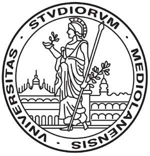

{width=100px height=100px}

# Tesauro bilingue sulla governance dell’intelligenza artificiale

[Link alla repository del progetto](https://github.com/mauritiuss/tesauro-ai)

## Introduzione

Il presente progetto, sviluppato nell’ambito del corso di *Editoria digitale*, ha come obiettivo la progettazione e realizzazione di un workflow editoriale per la gestione di un **tesauro bilingue (inglese-italiano) dedicato alla governance dell’intelligenza artificiale**.  

Il lavoro si concentra su tre aspetti fondamentali: 

- La scelta di un **formato sorgente strutturato** (JSON) capace di rappresentare termini, definizioni, relazioni semantiche e fonti normative;  
- La definizione di un **flusso di pubblicazione automatizzato**, basato su *MkDocs* e *GitHub Pages*, che garantisce aggiornabilità e accesso pubblico;  
- L’implementazione di un **processo editoriale trasparente e tracciabile**, supportato da template per *Issue* e *Pull Request*, linee guida di contributo e un sistema di versionamento (CHANGELOG + tag).  

Le tecnologie adottate (Python, GitHub Actions, MkDocs) hanno permesso di realizzare un sistema semplice ma efficace, in grado di unire la dimensione tecnica con quella editoriale.  

Il risultato è una piattaforma digitale che consente non solo la consultazione delle voci del tesauro, ma anche la partecipazione attiva degli utenti attraverso proposte di aggiornamento motivate e pubblicamente giustificate. In questo modo, il tesauro diventa uno strumento “vivo”, capace di seguire l’evoluzione terminologica dell’IA e di fornire un punto di riferimento trasparente e interdisciplinare.

## Ideazione

### Tema
Il tesauro bilingue affronta il tema della **governance dell’intelligenza artificiale**, un ambito caratterizzato da rapida evoluzione e da una forte necessità di chiarezza terminologica. I temi principali che il prodotto editoriale intende presentare sono:

- **Prospettiva normativa-giuridica**: terminologia derivata da regolamenti (es. AI Act europeo, DDL italiano 2025), convenzioni e standard internazionali.
- **Prospettiva tecnico-operativa**: concetti provenienti da standard ISO/IEC, dal NIST AI RMF e dalla pratica di sviluppo dei sistemi di IA.  
- **Prospettiva concettuale-filosofica**: nozioni emergenti come “IA agentica” o “autonomia degli agenti”, utili a comprendere l’evoluzione del dibattito etico e sociale.

### Destinatari

Il tesauro è pensato per un pubblico interdisciplinare che necessita di strumenti affidabili per orientarsi nel lessico della governance dell’IA. Per descrivere i destinatari si utilizza la tecnica delle **personas**, cioè profili rappresentativi di tipologie di utenti reali.

---

1. Persona 1 — *Giulia, Policy Maker*
   - **Profilo**: Funzionario del Ministero dello sviluppo Economico, 42 anni.
   - **Esigenze**: Comprende i termini tecnici presenti nei documenti normativi internazionali per adattarli al contesto legislativo italiano.  
   - **Scenario d'uso**: Giulia consulta il tesauro per verificare la coerenza terminologica tra il testo dell’AI Act europeo e il Disegno di Legge italiano del 2025, assicurandosi che la traduzione in italiano di concetti chiave sia uniforme.

---

2. Persona 2 — *Luca, Ingegnere AI*
   - **Profilo**: Ingegnere informatico in una startup di AI, 29 anni.  
   - **Esigenze**: Allineare la documentazione tecnica aziendale agli standard internazionali (ISO/IEC, NIST).  
   - **Scenario d’uso**: Luca utilizza il tesauro per trovare la traduzione corretta di *“risk-based approach”* e capisce come il termine è usato nel contesto delle normative e degli standard di settore, così da uniformare il manuale tecnico aziendale.

---

3. Persona 3 — *Sara, Ricercatrice di filosofia*
   - **Profilo**: Dottoranda in filosofia della tecnologia, 26 anni.  
   - **Esigenze**: analizzare le implicazioni etiche e concettuali di termini emergenti.  
   - **Scenario d’uso**: Sara consulta la voce *“IA agentica”* per esplorare le sue definizioni in inglese e in italiano, scoprendo anche i collegamenti semantici con concetti più ampi come *Artificial Intelligence* e le fonti normative in cui il termine è stato discusso.

---

4. Persona 4 — *Marco, Giornalista scientifico*
   - **Profilo**: Giornalista freelance specializzato in innovazione tecnologica, 35 anni.  
   - **Esigenze**: comunicare concetti complessi di IA a un pubblico generalista in modo chiaro e corretto.  
   - **Scenario d’uso**: Marco si affida al tesauro per scrivere un articolo sul dibattito internazionale riguardo alla *Generative AI*, utilizzando definizioni ufficiali e citando le fonti normative per rafforzare la credibilità del suo pezzo.

---

5. **Francesco, 50 anni, paziente con patologie croniche**
   - **Background**: Ha problemi di ipertensione e monitora la propria salute con uno smartwatch medico. È poco esperto di tecnologia.
   - **Obiettivi**: Monitorare parametri come la frequenza cardiaca e la temperatura corporea, evitando situazioni di rischio.
   - **Bisogni**: Interfaccia semplice e spiegazioni chiare sui dati, con indicazioni su quando è necessario consultare un medico.
   - **Scenario d'uso**:  Utilizza la WebApp per controllare i parametri vitali e si sente rassicurato dalla possibilità di accedere facilmente ai suoi dati.

---

### Sintesi
Queste personas mostrano come il tesauro possa essere utile a:  

- decisori politici (chiarezza normativa),  
- tecnici (coerenza con standard),  
- ricercatori e accademici (analisi concettuale),  
- divulgatori e giornalisti (comunicazione corretta).  

In questo modo, il prodotto editoriale risponde a esigenze diverse ma complementari, rafforzando la sua funzione di strumento interdisciplinare.

### Modello di fruizione

Per garantire l’efficacia del tesauro e la sua utilità per i destinatari individuati, sono stati definiti alcuni **requisiti di accettazione** e un modello di fruizione pensato per agevolare la consultazione interdisciplinare.

#### Requisiti di accettazione

- **Accessibilità online**: il tesauro deve essere disponibile come sito pubblico e navigabile.  
- **Aggiornabilità**: nuove voci devono poter essere aggiunte attraverso un processo chiaro e trasparente.  
- **Bilinguismo**: ogni voce deve includere sia la definizione in italiano sia quella in inglese.  
- **Tracciabilità**: tutte le modifiche devono essere documentate tramite versionamento e changelog.  
- **Partecipazione**: gli utenti devono poter proporre aggiornamenti e ricevere giustificazioni pubbliche delle decisioni editoriali.

#### Modelli di lettura e fruizione
- **Consultazione tematica**: ricerca di termini per ID o per parola chiave.  
- **Navigazione semantica**: esplorazione dei concetti attraverso relazioni *broader*, *narrower* e *related*.  
- **Filtro per lingua**: possibilità di visualizzare definizioni in italiano, inglese o entrambe.  
- **Allineamento normativo**: accesso diretto alle fonti (AI Act, ISO/IEC, NIST) collegate a ciascun termine.

#### Standard di riferimento
- **ISO/IEC 22989:2022** – Terminologia AI.  
- **ISO/IEC 23894:2023** – Gestione del rischio in sistemi di IA.  
- **NIST AI Risk Management Framework (2023)**.  
- **AI Act europeo (Reg. UE 1689/2024)** e normative nazionali.  

Questi standard garantiscono che la terminologia utilizzata sia coerente con documenti riconosciuti a livello internazionale.

#### Aspetti di innovazione
- **Processo di fruizione**: gli utenti non si limitano a leggere, ma possono partecipare attivamente con proposte di aggiornamento strutturate tramite template dedicati.  
- **Trasparenza editoriale**: ogni decisione (approvazione o rifiuto) è pubblicata e motivata.  
- **Aggiornabilità dinamica**: il workflow GitHub Actions consente di pubblicare automaticamente il sito a ogni modifica approvata.  
- **Documentazione viva**: grazie a *CHANGELOG* e *tag versioni*, lo storico rimane sempre accessibile e navigabile.  

In questo modo, il tesauro si configura non solo come un prodotto editoriale statico, ma come una piattaforma **collaborativa, tracciabile e innovativa**, in grado di evolvere insieme al linguaggio dell’intelligenza artificiale.

### Canali di distribuzione
Il tesauro è concepito come risorsa digitale multicanale, per raggiungere pubblici diversi e adattarsi a differenti contesti di fruizione.  

#### Canali principali
- **Web**: pubblicazione principale tramite sito statico generato con *MkDocs* e distribuito su *GitHub Pages*.  
- **Social**: condivisione di aggiornamenti e nuove versioni tramite canali istituzionali (es. LinkedIn o X/Twitter) per favorire la diffusione delle novità.  
- **Repository GitHub**: punto di riferimento per gli esperti e contributori, che possono accedere direttamente al sorgente (`tesauro.json`) e al flusso editoriale.  
- **Intranet accademica/istituzionale** (opzionale): possibile integrazione in contesti interni (università, enti di ricerca) come risorsa di riferimento per corsi o policy interne.  

#### Formati dati previsti
- **JSON**: formato sorgente, strutturato e leggibile dalle macchine.  
- **Markdown / WebBook**: formato di consultazione, ottimizzato per il web.  
- **PDF** (generabile da MkDocs): per distribuzione offline e archiviazione istituzionale.

#### Identità visuale e stile tipografico
- **Tipografia**: caratteri sans-serif leggibili sul web (es. *Roboto*, *Inter*) con utilizzo di titoli ben gerarchizzati (H1, H2, H3).  
- **Colori e layout**: interfaccia minimale, con palette neutra, per mettere in risalto il contenuto testuale.  
- **Stile redazionale**:  
  - Tono **formale e professionale**, adatto a documenti normativi e scientifici;  
  - Uso coerente di termini bilingui (IT/EN);  
  - Citazione sistematica delle fonti.

In questo modo, il tesauro assume un’identità editoriale chiara e affidabile, comunicando rigore formale nei contenuti e innovazione nei processi di gestione.

## Processo di Produzione

### Acquisizione dei contenuti

La costruzione del tesauro si basa su un insieme selezionato di fonti normative, standard tecnici e documenti concettuali. La scelta delle fonti tiene conto sia della loro rilevanza scientifica e istituzionale, sia del costo di acquisizione in termini di tempo e risorse.

#### Fonti libere e disponibili pubblicamente
- **AI Act europeo (Reg. UE 1689/2024)**: testo legislativo disponibile in formato digitale multilingue sul portale EUR-Lex.  
- **Convenzione quadro del Consiglio d’Europa sull’IA**: documento accessibile gratuitamente sul sito del Consiglio d’Europa.  
- **GPAI Codes of Practice**: linee guida rese disponibili pubblicamente dal partenariato globale sull’IA.  
- **NIST AI Risk Management Framework (2023)**: pubblicato in modalità open access.  

Queste fonti costituiscono la base normativa e policy del tesauro, senza costi diretti di acquisizione.

#### Fonti standard internazionali (parzialmente a pagamento)
- **ISO/IEC 22989:2022** (terminologia AI).  
- **ISO/IEC 23894:2023** (gestione del rischio nei sistemi di IA).  

Questi standard sono di riferimento imprescindibile, ma la loro acquisizione comporta un costo economico. L’integrazione nel tesauro avviene selezionando i concetti chiave, nel rispetto delle licenze di utilizzo.

#### Contenuti generabili automaticamente
- **Metadati di traduzione bilingue**: parte delle traduzioni inglese-italiano può essere supportata da strumenti di traduzione assistita (CAT tools), che velocizzano il processo mantenendo la coerenza terminologica.  
- **Estratti da documenti pubblici**: l’uso di parser per documenti in XML/HTML consente di importare automaticamente definizioni e riferimenti normativi.

#### Contenuti da redigere manualmente
- **Concetti emergenti** (es. *IA agentica*, *IA generativa*): non sempre presenti in fonti istituzionali, richiedono un lavoro di definizione e contestualizzazione redazionale.  
- **Relazioni semantiche (broader, narrower, related)**: la classificazione non è automatizzabile in modo affidabile e deve essere validata editorialmente.  
- **Note esplicative e giustificazioni**: ogni decisione editoriale (approvazione, rifiuto, modifica) viene redatta manualmente dal comitato e pubblicata a beneficio degli utenti.

Questo approccio ibrido assicura al tesauro sia **rigore istituzionale**, sia **flessibilità innovativa** nell’inclusione di concetti nuovi.

### Gestione documentale
Il flusso di gestione documentale del tesauro è stato progettato per garantire **trasparenza, aggiornabilità e tracciabilità** in ogni fase del processo. Le principali tappe sono:

1. **Ideazione**: Identificazione dei concetti e dei termini più rilevanti per la governance dell’intelligenza artificiale, sulla base delle esigenze emerse dalle *personas* (policy maker, ingegneri, ricercatori, giornalisti). Questa fase ha permesso di selezionare i contenuti che avrebbero avuto maggiore utilità per gli utenti finali.
2. **Acquisizione dei contenuti**: Raccolta delle informazioni da fonti normative, standard internazionali e documenti scientifici. In particolare: AI Act europeo, Convenzione del Consiglio d’Europa, GPAI Codes of Practice, NIST AI RMF e standard ISO/IEC. Sono stati inclusi anche concetti emergenti (es. *IA agentica*, *IA generativa*) tramite lavoro redazionale.
3. **Valutazione dei diritti**: Classificazione delle fonti in base ai vincoli di utilizzo:  
   - fonti **libere e open access** (es. AI Act, NIST RMF),  
   - fonti **a pagamento con licenza** (ISO/IEC),  
   - contenuti **redatti manualmente** (concetti filosofici o emergenti).  
   Questo garantisce il rispetto delle regole di copyright e citazione.
4. **Strutturazione dei contenuti**: Organizzazione dei termini nel formato sorgente **JSON** (`tesauro.json`). Ogni voce include ID, definizione bilingue, fonti, relazioni semantiche (*broader*, *narrower*, *related*) e varianti terminologiche. Questa fase assicura coerenza e uniformità nella rappresentazione dei dati.
5. **Trasformazione dei formati**: Attraverso lo script Python `generate_docs.py`, i contenuti JSON vengono trasformati automaticamente in file **Markdown** (`docs/terms/AIxxx.md`) e in un indice di consultazione. Questo passaggio permette la creazione di una documentazione navigabile e facilmente pubblicabile.
6. **Applicazione dello stile grafico**: Utilizzo del framework **MkDocs** per pubblicare il tesauro come sito statico. Sono state adottate scelte di identità visiva sobrie (tipografia sans-serif, layout minimale, gerarchie di titoli chiare) per privilegiare la leggibilità dei testi e la consultazione rapida.
7. **Generazione dei metadati**: Aggiunta di informazioni complementari (ID univoco, relazioni semantiche, fonti normative, varianti) sia all’interno delle voci sia nel versionamento GitHub (storico commit, changelog, tag). I metadati garantiscono tracciabilità e trasparenza editoriale.
8. **Revisione e approvazione**: Ogni proposta di modifica viene presentata tramite **Issue** con motivazioni e fonti obbligatorie. Il comitato editoriale valuta, approva o rifiuta le modifiche, fornendo una giustificazione pubblica. Le modifiche approvate generano una **Pull Request**, che viene verificata e fusa nel branch `main`.
9. **Distribuzione dei contenuti**: La pubblicazione avviene tramite **GitHub Pages**, che aggiorna automaticamente il sito a ogni modifica del branch principale. In questo modo, il tesauro rimane sempre aggiornato e accessibile pubblicamente.

### Tecnologie adottate
Lo sviluppo del tesauro ha richiesto l’integrazione di diverse tecnologie, ciascuna delle quali ha contribuito a raggiungere gli obiettivi descritti negli scenari d’uso.

| Tecnologia       | Fase di utilizzo                                | Contributo |
|------------------|-------------------------------------------------|------------|
| **JSON**         | Formato sorgente per le voci del tesauro         | Strutturazione dei dati (ID, definizioni IT/EN, fonti, relazioni) |
| **Python**       | Generazione automatica dei file Markdown         | Automazione, riduzione errori, aggiornamenti rapidi |
| **Markdown**     | Rappresentazione dei contenuti editoriali        | Facilità di scrittura e leggibilità umana | 
| **MkDocs**       | Pubblicazione del sito statico                   | Interfaccia web chiara, responsive e navigabile |
| **GitHub Pages** | Hosting e distribuzione automatica               | Aggiornamento continuo e accesso pubblico |
| **Git + GitHub** | Versionamento, collaborazione, workflow editoriale | Tracciabilità storica, Issues e Pull Request per feedback |
| **Template Issues/PR** | Raccolta feedback e proposte di aggiornamento | Trasparenza, motivazioni obbligatorie, giustificazioni pubbliche |
| **CHANGELOG + Tag** | Documentazione delle versioni                  | Storico chiaro delle modifiche con semver |
| **Tema MkDocs**  | Identità visuale e tipografia                    | Layout sobrio, font leggibili, gerarchie di titoli |

### Esecuzione del flusso
Tutti i materiali, script e configurazioni necessari per riprodurre il flusso di produzione documentale sono disponibili nel repository GitHub associato al progetto disponibile a questo [link](https://github.com/mauritiuss/tesauro-ai).

## Valutazione dei risultati raggiunti

### Valutazione del flusso di produzione

Il workflow editoriale implementato ha prodotto miglioramenti significativi rispetto a un processo manuale e non strutturato:

1. **Riduzione dei tempi di gestione documentale**: l’automazione con Python ha ridotto sensibilmente i tempi di gestione documentale, permettendo di trasformare i contenuti dal formato sorgente JSON a documentazione navigabile in pochi minuti invece che in ore di lavoro manuale.  
2. **Riduzione degli errori**: la gestione centralizzata delle informazioni in JSON e la generazione automatica delle pagine hanno ridotto gli errori, evitando incoerenze, duplicazioni o refusi tipografici.  
3. **Miglioramento della qualità dei documenti**: la qualità dei documenti è stata migliorata grazie a una struttura uniforme delle voci, alla presenza di metadati (ID, relazioni, fonti) e a un processo di revisione editoriale che garantisce coerenza e affidabilità. 
4. **Miglioramento del livello di accettazione della tecnologia**: il livello di accettazione della tecnologia è aumentato perché l’uso di GitHub rende il flusso trasparente e collaborativo, mentre MkDocs offre un’interfaccia web semplice e accessibile anche a utenti non tecnici.  
5. **Raggiungimento di nuovi canali di distribuzione**: i canali di distribuzione sono stati ampliati: la presenza di GitHub rende i dati accessibili anche per sviluppatori e ricercatori.
6. **Soddisfacimento di nuovi scenari d’uso**: i nuovi scenari d’uso sono stati soddisfatti poiché policy maker, tecnici, ricercatori e giornalisti hanno ora uno strumento consultabile online, aggiornabile e fondato su fonti normative e standard internazionali.  

### Confronto con lo stato dell'arte

Nella situazione **AS-IS**, i glossari e i documenti disponibili erano statici, spesso in PDF o Word, aggiornati manualmente e privi di tracciabilità. Le scelte terminologiche non erano trasparenti, mancava un sistema di feedback strutturato e gli utenti non avevano strumenti per proporre modifiche.  

Con il modello **TO-BE**, invece, i contenuti sono organizzati in un formato sorgente strutturato (JSON), trasformati automaticamente in documentazione navigabile (Markdown + MkDocs) e pubblicati in modo continuo tramite GitHub Pages. L’introduzione di Issues, Pull Request e Changelog ha reso il flusso editoriale trasparente e collaborativo, permettendo agli utenti di partecipare attivamente e seguire l’evoluzione storica del tesauro.

### Limiti emersi
Nonostante i risultati raggiunti, sono emersi alcuni limiti:
- **Accesso alle fonti**: gli standard ISO/IEC sono a pagamento e non integralmente integrabili. Questo limita la completezza del tesauro.  
- **Automazione parziale**: alcune fasi, come la definizione delle relazioni semantiche (*broader, narrower, related*), richiedono ancora una validazione manuale.  
- **Integrazione dei contributi**: il workflow GitHub richiede una minima familiarità con gli strumenti da parte degli utenti esterni, il che può limitarne l’adozione.  
- **Visualizzazione avanzata**: la consultazione avviene in formato testuale; non sono ancora stati implementati strumenti di visualizzazione interattiva delle relazioni semantiche.

Il progetto dimostra la fattibilità di un workflow editoriale digitale per un tesauro bilingue, che migliora significativamente tempi, qualità e trasparenza rispetto ai metodi tradizionali. Tuttavia, restano margini di miglioramento nell’automazione completa, nell’integrazione delle fonti e nelle funzionalità di visualizzazione.
 
## Conclusioni
Il progetto ha dimostrato la possibilità di realizzare un workflow editoriale digitale per la gestione di un tesauro bilingue dedicato alla governance dell’intelligenza artificiale. Gli obiettivi definiti negli scenari d’uso sono stati in gran parte raggiunti: policy maker, ingegneri, ricercatori e giornalisti dispongono ora di uno strumento consultabile online, aggiornabile e tracciabile, che unisce rigore normativo e flessibilità tecnica.  

I risultati più soddisfacenti riguardano la riduzione dei tempi di gestione documentale, resa possibile dall’automazione della trasformazione dei contenuti, e l’aumento della trasparenza editoriale, garantita dal sistema di versionamento, dalle giustificazioni pubbliche e dalla possibilità per gli utenti di proporre modifiche tramite GitHub. Anche la qualità dei documenti è migliorata grazie a una struttura coerente e alla presenza di metadati chiari.  

Permangono tuttavia alcune limitazioni: l’accesso parziale a standard a pagamento come ISO/IEC, la necessità di validazione manuale per le relazioni semantiche e la curva di apprendimento legata all’uso di GitHub per contributori non esperti. Questi aspetti rappresentano margini di miglioramento futuri, ad esempio attraverso l’adozione di interfacce più intuitive o di strumenti di visualizzazione avanzata delle relazioni semantiche.  

In conclusione, il workflow proposto ha reso il tesauro uno strumento “vivo”, capace di evolversi nel tempo e di supportare in modo interdisciplinare il lavoro di policy making, ricerca e divulgazione, pur lasciando spazio a sviluppi ulteriori per ampliarne accessibilità e funzionalità.

## Bibliografia e sitografia

- Parlamento Europeo e Consiglio dell’Unione Europea (2024). *AI Act – Regolamento UE 1689/2024*. Disponibile su [EUR-Lex](https://eur-lex.europa.eu/).  
- Consiglio d’Europa (2024). *Convenzione quadro sull’intelligenza artificiale*. Disponibile su [coe.int](https://www.coe.int/).  
- GPAI (2023). *Codes of Practice on Artificial Intelligence*. Disponibile su [gpai.ai](https://gpai.ai/).  
- NIST (2023). *AI Risk Management Framework*. Disponibile su [nist.gov](https://www.nist.gov/).  
- ISO/IEC (2022). *22989:2022 Artificial Intelligence – Concepts and terminology*. International Organization for Standardization.  
- ISO/IEC (2023). *23894:2023 Artificial Intelligence – Risk management*. International Organization for Standardization.  
- GitHub. *Repository tesauro-ai*. Disponibile su [github.com/mauritiuss/tesauro-ai](https://github.com/mauritiuss/tesauro-ai).  
- MkDocs (2024). *Project documentation with Markdown*. Disponibile su [mkdocs.org](https://www.mkdocs.org/).  